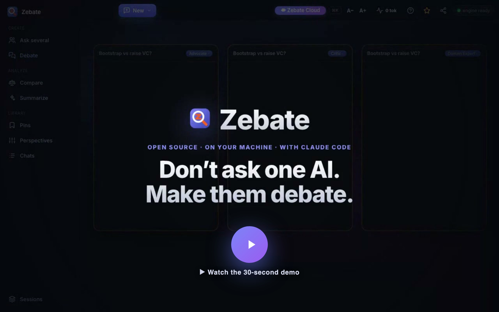
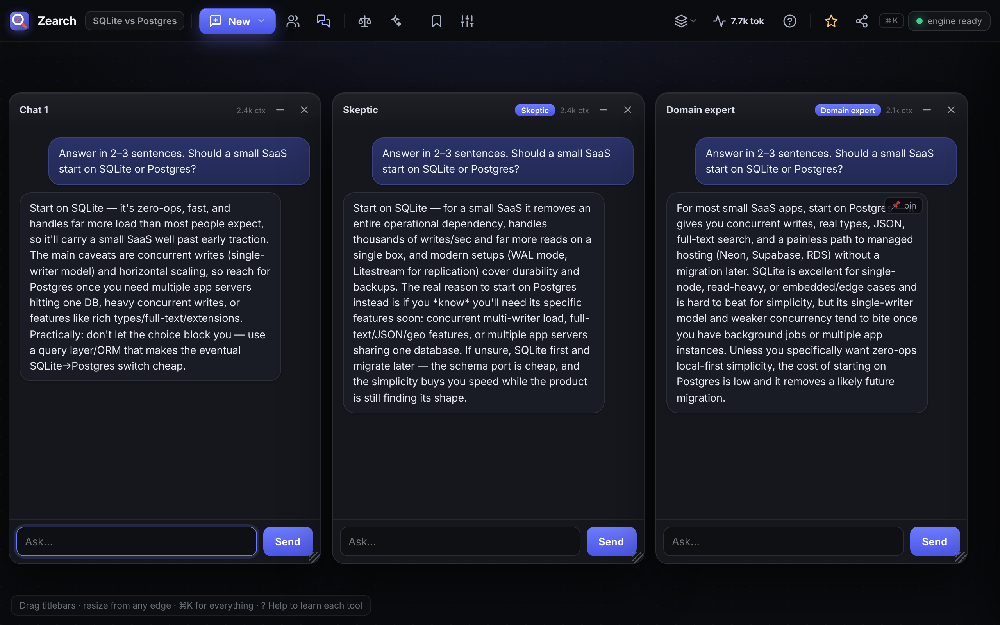

<div align="center">


# Zebate

### Open-source, on-machine agentic debate.

Spin up rival AI agents that **argue your question to the ground** — across rounds, until one answer survives — running **locally, on your own Claude**. No API key. No cloud.

[](LICENSE)


<a href="https://zebate.pages.dev"></a>

<sub><a href="https://zebate.pages.dev">▶ Watch the 30-second demo</a></sub>

</div>

> **One question → rival agents → they debate → a verdict.**
> Most tools give you *more* agents. Zebate makes them **argue** — locally, on the `claude` CLI you already have. The debate happens on your machine; nothing is brokered through a cloud.

---

## Why Zebate

A single chat gives you one voice that tends to agree with itself. Even "multi-agent" tools usually just run agents *in parallel* and staple the answers together. The hard part isn't running many agents — it's making them **disagree productively**:

- ⚔️ **Agentic debate (the moat)** — agents answer, then *see each other's answers and rebut* across rounds; a neutral moderator calls the verdict. Catches the confident-but-wrong answer a lone chat hands you.
- 🖥️ **On your machine** — the whole thing runs on your own `claude` CLI. No API key, no account, no cloud relay. Your prompts go exactly where they already go when you use Claude Code.
- 👥 **Parallel perspectives** — ask once, hear many expert viewpoints side by side.
- ⚖️ **Capture · Compare · Summarize** — pin findings, rank options in weighted tables, merge chats into one cited write-up.

<div align="center">

<br/><em>One question, several rival agents — side by side. Debate takes it the rest of the way.</em>
</div>

---

## Quickstart

**Prerequisites:** [Node 18+](https://nodejs.org) and [Claude Code](https://docs.anthropic.com/en/docs/claude-code) installed & logged in (you can run `claude` in your terminal).

```bash
git clone https://github.com/waqaszs/zebate.git
cd zebate
pnpm start          # or: node src/server.mjs
```

Your browser opens at **http://localhost:8899**. No keys to paste, nothing to configure.

---

## Sessions — research several topics in parallel

A **session** is an isolated workspace: its own windows, pins, and its own browser tab. Run as many as you like — each one is independent.

```bash
SESSION="Pricing model"   pnpm start    # terminal 1 → its own UI + data
SESSION="Database choice"  pnpm start    # terminal 2 → separate UI + data
```

Or start one without leaving the app: open the **Sessions** menu → **+ New session**, name the topic, and Zebate spins up a fresh isolated instance and opens its tab for you. Re-launching a name **resumes** that session — your work persists on disk.

> Each session writes to its own `data/sessions/<name>.json`. Closing a session's terminal (or tab + server) just stops it; nothing is deleted.

---

## The research loop

| Step | Tools | What happens |
|------|-------|--------------|
| **💬 Explore** | New chat · Ask several · **Debate** | Open chats, fan a question across perspectives, or have rival agents debate to a verdict. |
| **📌 Capture** | Pins | Keep the answers worth remembering on a board. |
| **⚖️ Decide** | Compare · Summarize | Rank options in a weighted table, or merge chats into one cited summary. |
| **⭳ Share** | Export | Send any summary to Markdown. |

- **Perspectives are yours** — a "perspective" is just a named system prompt. Edit, add or remove them in the Perspectives panel.
- **You stay in control** — while a chat answers, **Send** becomes **Stop**; the Usage panel shows each chat's context and your account's rate-limit window, with one-click **Compact** for long chats.

---

## How it works

```
  browser UI  ──HTTP/SSE──▶  src/server.mjs  ──spawns──▶  claude -p --resume <session>
   (vanilla JS)              (zero-dep node:http)          (your CLI · your login)
```

- Each window owns its own **resumable** Claude session; debates orchestrate several of them across rounds plus a moderator pass.
- Replies **stream token-by-token** over Server-Sent Events; abort instantly with Stop.
- **Zero npm dependencies** — pure Node + vanilla JS. The whole backend is one file.

---

## FAQ

**Do I need an Anthropic API key?** No. Zebate drives the `claude` CLI you're already logged into — it uses your existing Claude Code subscription, exactly like running `claude` yourself.

**Does anything leave my machine?** Only what already leaves when you use Claude Code (your prompts go to Anthropic via the CLI). Zebate itself adds **no cloud, no account, no telemetry** — the server is `localhost`.

**Will a debate spend my limits?** A debate is several agent calls across rounds, so yes, more than a single chat — the Usage panel keeps that visible, and Compact helps long chats stay cheap.

**Is it really free?** Yes — free and **open-source (Apache-2.0)**. Use it, fork it, ship it.

---

## Zebate Cloud (coming soon)

**Zebate On-Machine** stays free & open-source, forever. **Zebate Cloud** is a separate hosted product that takes your research further:

- **Cross-device persistence** — chats, pins & debates saved in the cloud, synced across all your devices
- **Any model provider** — run perspectives on Claude, GPT, Gemini or local models — even mix them in one debate
- **Export to reports** — turn any research or debate into a polished, shareable report in multiple formats
- **PDF · slides · video · infographic** — auto-convert a debate into a PDF, slide deck, explainer video or infographic
- **Teams & sharing** — shared workspaces, and publish a finished debate as a link
- **Zero setup** — no CLI, no keys to manage

**→ [Join the waitlist](https://zebate.pages.dev/#join)**

## Contributing

Issues and PRs welcome. It's a single static frontend (`public/index.html`) and a single backend file (`src/server.mjs`) with no build step — clone, edit, refresh.

If Zebate is useful to you, **★ star the repo and share it** — that's how other developers find it.

---

## License & trademark

**Zebate On-Machine** (this repo) is **free & open-source** under the **Apache-2.0 License** — © [ZedStack](https://zedstack.com), built by [Waqas Haider](https://www.linkedin.com/in/waqaszs/). **Zebate Cloud** is a separate hosted product (coming soon).

The Zebate **name and logo** are trademarks of ZedStack — the Apache-2.0 license covers the *code*, not the brand. See [TRADEMARK.md](TRADEMARK.md). Forks are welcome; please **rebrand** before distributing publicly.

<div align="center"><sub>Zebate is a free, open tool from ZedStack — we build interactive experiences for learning, product discovery, and research.</sub></div>
